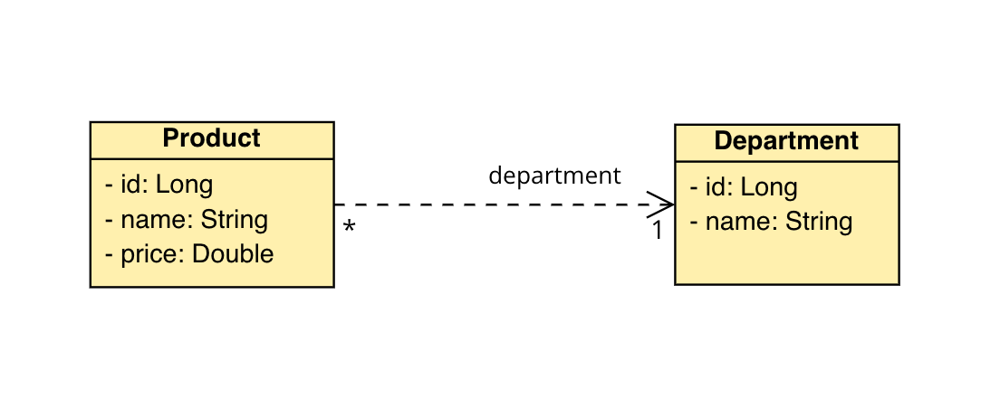

# Java and Spring Rest API

> "Practical Example - DevSuperior | Nélio Alves"



## Introduction

1. Web Server - It is the application that receives the backend, made in Java with Spring, for example, managing to "listen" to requests from a client. In a standard Spring Boot project, this tool is Tomcat.
2. Java Spring Boot App (Multi-threading) - For each incoming request, this application will open a thread of the server's running process, to execute some business logic/processing and return a response.
    1. **Multithreading**
    2. **_URL_ Mapping**
    3. ***JSON* Serialization**

## Getting Started

It is noticed that this project has two entities, **Product** and **Department**. From this, the classes representing these entities will be created normally in a package called `entities` in the project.

`entities/Departament`

```java
public class Department {

    private long id;
    private String name;

    public Department(long id, String name) {
        this.id = id;
        this.name = name;
    }

    public Department() {
    }

    public long getId() {
        return id;
    }

    public void setId(long id) {
        this.id = id;
    }

    public String getName() {
        return name;
    }

    public void setName(String name) {
        this.name = name;
    }
}
```

`entities/Product`

```java
public class Product {

    private long id;
    private String name;
    private double price;
    private Department department;

    public Product(long id, String name, double price, Department department) {
        this.id = id;
        this.name = name;
        this.price = price;
        this.department = department;
    }

    public Product() {
    }

    public long getId() {
        return id;
    }

    public void setId(long id) {
        this.id = id;
    }

    public String getName() {
        return name;
    }

    public void setName(String name) {
        this.name = name;
    }

    public double getPrice() {
        return price;
    }

    public void setPrice(double price) {
        this.price = price;
    }

    public Department getDepartment() {
        return department;
    }

    public void setDepartment(Department department) {
        this.department = department;
    }
}
```

To connect requests with the application, the creation of a controller is necessary.

`controller/DepartamentController`

```java
@RestController
@RequestMapping(value = "/departaments")
public class DepartamentController {

    @GetMapping
    public List<Product> getProducts() {

        Department d1 = new Department(1L, "Tech");
        Department d2 = new Department(2L, "Pet");

        Product p1 = new Product(1L, "Macbook Pro", 4000.0, d1);
        Product p2 = new Product(2L, "PC Gamer", 5000.0, d1);
        Product p3 = new Product(3L, "Pet House", 300.0, d2);
        
        return List.of(p1, p2, p3);
    }
}
```

Creating a controller that makes a resource of the application available becomes very simple using the framework (Spring Boot), once the following Annotations are used:

- `@RestController` -Spring recognizes this class as a controller.
- `@RequestMapping(value = "/departments")` - - Spring considers this resource at the `/departments` route.
- `@GetMapping` - Spring understands that it is an endpoint with a `GET` _HTTP_ method.